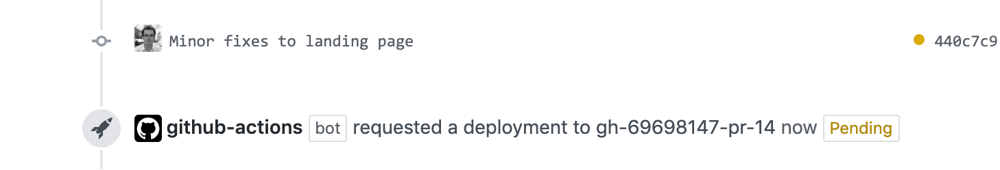
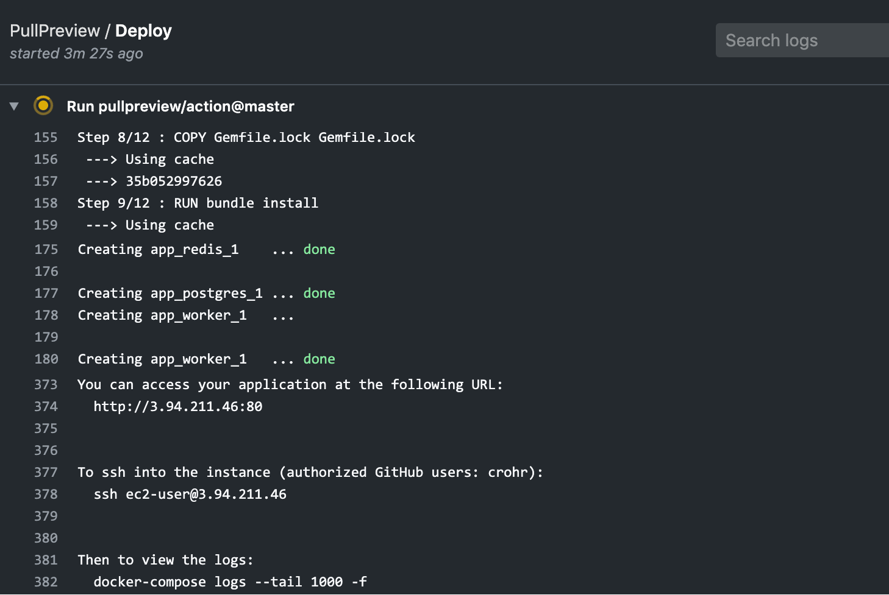

# PullPreview

A GitHub Action that starts live environments for your pull requests and branches.

## Spin environments in one click

Once installed in your repository, this action is triggered any time a change
is made to Pull Requests labelled with the `pullpreview` label, or one of the
_always-on_ branches.

When triggered, it will:

1. Check out the repository code
2. Provision a cheap AWS Lightsail instance, with docker and docker-compose set up
3. Continuously deploy the specified pull requests and branches, using your docker-compose file(s)
4. Report the preview instance URL in the GitHub UI

It is designed to be the **no-nonsense, cheap, and secure** alternative to
services that require access to your code and force your app to fit within
their specific deployment system and/or require a specific config file.




## Useful for the entire team

- **Product Owners**: Interact with a new feature as it's built, give valuable feedback earlier, reduce wasted development time.
- **Developers**: Show your work in progress, find bugs early, deliver the right feature.
- **Ops**: Concentrate on high value tasks, not maintaining staging environments.
- **CTOs**: Don't let your code run on third-party servers: your code always stays private on either GitHub's or your servers.

## Features

Preview environments that:

- work with your **existing tooling**: If your app can be started with
  docker-compose, it can be deployed to preview environments with PullPreview.

- can be **started and destroyed easily**: You can manage preview environments
  by adding or removing the `pullpreview` label on your Pull Requests. You can
  set specific branches as always on, for instance to continuously deploy your
  master branch.

- are **cheap too run**: Preview environments are launched on AWS Lightsail
  instances, which are both very cheap (10USD per month, proratized to the
  duration of the PR), and all costs included (bandwith, storage, etc.)

- take the **privacy** of your code seriously: The workflow happens all within
  a GitHub Action, which means your code never leaves GitHub or your Lightsail
  instances.

- make the preview URL **easy to find** for your reviewers: Deployment statuses
  and URLs are visible in the PR checks section, and on the Deployments tab in
  the GitHub UI.

- **persist state** across deploys: Any state stored in docker volumes (e.g.
  database data) will be persisted across deploys, making the life of reviewers
  easier.

- are **easy to troubleshoot**: You can give specific GitHub users the
  authorization to SSH into the preview instance (with sudo privileges) to
  further troubleshoot any issue. The SSH keys that they use to push to GitHub
  will automatically be installed on the preview servers.

- are **integrated into the GitHub UI**: Logs for each deployment run are
  available within the Actions section, and direct links to the preview
  environments are available in the Checks section of a PR, and in the
  Deployments tab of the repository.




## Installation & Usage

- [Getting Started](https://github.com/pullpreview/action/wiki/Getting-Started)
- Action [Inputs](https://github.com/pullpreview/action/wiki/Inputs) / [Outputs](https://github.com/pullpreview/action/wiki/Outputs)
- Handling [Seed Data](https://github.com/pullpreview/action/wiki/Seed-Data)
- [Workflow Examples](https://github.com/pullpreview/action/wiki/Workflow-Examples)
- [FAQ](https://github.com/pullpreview/action/wiki/FAQ)

&rarr; Please see the [wiki](https://github.com/pullpreview/action/wiki) for the full documentation.

## Example

Workflow file with the `master` branch always on:

```yaml
# .github/workflows/pullpreview.yml
name: PullPreview
on:
  # the schedule is optional, but helps to make sure no dangling resources are left when GitHub Action does not behave properly
  schedule:
    - cron: "30 2 * * *"
  push:
    branches:
      - main
  pull_request:
    types: [labeled, unlabeled, synchronize, closed, reopened]

jobs:
  deploy:
    if: github.event_name == 'schedule' || github.event_name == 'push' || github.event.label.name == 'pullpreview' || contains(github.event.pull_request.labels.*.name, 'pullpreview')
    runs-on: ubuntu-latest
    timeout-minutes: 30
    steps:
      - uses: actions/checkout@v2
      - uses: pullpreview/action@v5
        with:
          # Those GitHub users will have SSH access to the servers
          admins: crohr,other-github-user
          # A staging environment will always exist for the master branch
          always_on: main
          # Use the cidrs option to restrict access to the live environments to specific IP ranges
          cidrs: "0.0.0.0/0"
          # PullPreview will use those 2 files when running docker-compose up
          compose_files: docker-compose.yml,docker-compose.pullpreview.yml
          # The preview URL will target this port
          default_port: 80
          # Use a 512MB RAM instance type instead of the default 2GB
          instance_type: nano_2_0
          # Ports to open on the server
          ports: 80,5432
        env:
          AWS_ACCESS_KEY_ID: "${{ secrets.AWS_ACCESS_KEY_ID }}"
          AWS_SECRET_ACCESS_KEY: "${{ secrets.AWS_SECRET_ACCESS_KEY }}"
          AWS_REGION: "us-east-1"
```

## Is this free?

The code for this Action is completely open source, and licensed under the
Prosperity Public License (see LICENSE).

If you are a non-profit individual, then it is free to run (in that case, please tell me
so and/or pass the word around!).

In all other cases, you must buy a license. More details on [pullpreview.com](https://pullpreview.com).

Thanks for reading until the end!
